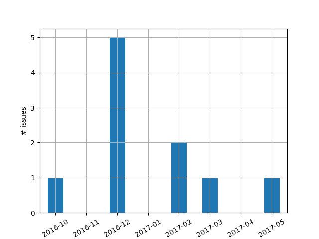

# Shifthelper report 05.09.2017

D.Neise

# What's checked?

| Name                           | limit        | Interval[s] | conditions                     |
|--------------------------------|--------------|-------------|--------------------------------|
| SmartFactUpToDate              | > 10 min     | 120         | only during shift              |
| ParkingChecklistFilled         | after 10min  | 120         | only **outside** shift         |
| IsUserAwakeBeforeShutdown      | 20min before | 120         | only during shift              |
| MAGICWeatherUpToDate           | > 10 min     | 120         | only during shift              |
| Shifter in shift scheduler     |              | 120         | only during shift              |
| MainJsStatusCheck              | Running?     | 120         | only during shift              |
| WindSpeedCheck                 | > 50 km/h    | 120         | only during shift & not parked |
| WindGustCheck                  | > 50 km/h    | 120         | only during shift & not parked |
| MedianCurrentCheck             | > 115 uA     | 120         | only during shift              |
| MaximumCurrentCheck            | > 160 uA     | 120         | only during shift              |
| RelativeCameraTemperatureCheck | > 15.0°C     | 120         | only during shift              |
| BiasNotOperatingDuringDataRun  |              | 120         | only during shift              |
| BiasChannelsInOverCurrent      |              | 120         | only during shift              |
| BiasVoltageNotAtReference      |              | 120         | only during shift              |
| ContainerTooWarm               | > 42°C       | 120         | only during shift              |
| DriveInErrorDuringDataRun      |              | 120         | only during shift              |
| BiasVoltageOnButNotCalibrated  |              | 120         | only during shift              |
| DIMNetworkNotAvailable         |              | 120         | only during shift              |
| NoDimCtrlServerAvailable       |              | 120         | only during shift              |
| TriggerRateLowForTenMinutes    | < 1/sec      | 120         | only during shift              |
| Flare                          | (individual) | 300         |                                |

# Experience?

Shifthelper is running unmodified since 23.07.2017

## 24.07. Remove unnecessary fallback calls:

Under certain conditions acknowledged alerts were not being removed form the alert list
and thus the fallback was called unnecessaringly.

At the same moment, a more severe bug was found an removed. In case the call
to the shifter threw an exception, the fallback was not called.
An exception was raised, because the number to be called was an
international number from a country our Twilio contract was (for security reasons)
not allowed to make calls to. Now we may make calls to the whole world. This bug was found using the test call during startup. Making test calls (DummyAlert) is a part of the startup checklist.

## 17.07. Fix cache misses

This lead to expert calls about every 200 minutes.
Using a different cache library fixed these.

## 19.04. Fix connection timeouts of the mysql db

These lead to expert calls. Recycling the connection pool fixed these.

## 13.04. Multiple:

 * set smart_fact_crawler timeout = 5 seconds
        --> expert calls when smart_fact cannot be seen.
 * Fix cloning of local DB copy --> lead to expert calls

## 28.02. Allow shifters to change their phone numbers.

The shifter contact DB was cloned only once at SH startup. So changes in contact
details would require a SH restart.

## 06.02. Fix Flare Alerts

 * In case of FlareAlert a shifter was called without end.
 * Fallback shifter was not called in this case.

# How is it running?

Shifthelper is running in one of two places:

 * Either the Rancher cloud at TU Dortmund (https://shifthelper.app.tu-dortmund.de/)
 * Or on a desktop PC at ETH Zurich (https://ihp-pc41.ethz.ch/)

The shifhelper runs two processes in supervised containers which get restatred when they crash ([Docker container](https://www.docker.com/)):

 * shifthelper
 * webinterface

In case the webinterface gets DDOSed, the shifthelper still runs and calls people,
but they cannot acknowledge the calls anymore. Very annoying but at least safe.

# Reported Safety issues?

In order to see if we can really trust the shifthelper v1.1.4, I listed below
the issues which were reported.

The plot below and the link list gives an overview about "Safety" issues.

As one can see from the Titles, even in these cases, still **sombody was called**, just not the right person.
So often fallback instead of shifter.
Or there was really no call, but it was realized during startup.

In fact **No critical issue was reported to us in 2017** but these issues here come closest to what might have been ciritcal.

 * 2016-10-22 - [no call - during test 21.10.16](https://github.com/fact-project/shifthelper/issues/118)

---

 * 2016-12-05 - [Calling fails comlpetely if shifter has not a valid phonenumber](https://github.com/fact-project/shifthelper/issues/168)
 * 2016-12-05 - [shifthelper does not call shifter - directly fallback shifter. tescall insufficient?](https://github.com/fact-project/shifthelper/issues/166)
 * 2016-12-10 - [no call, when smartfact dies](https://github.com/fact-project/shifthelper/issues/169)
 * 2016-12-16 - [shifters were not called](https://github.com/fact-project/shifthelper/issues/175)
 * 2016-12-29 - [shifter was not called - fallback was called instead](https://github.com/fact-project/shifthelper/issues/193)

 ---

 * 2017-02-04 - [Shifthelper kept calling and sending me Telegram messages every 5 minutes and informed me about FlareAlert](https://github.com/fact-project/shifthelper/issues/207)
 * 2017-02-04 - [Shifthelper does not call fallback shifter in case of FlareAlerts](https://github.com/fact-project/shifthelper/issues/209)

 ---

 * 2017-03-25 - [Test call does not work on first try](https://github.com/fact-project/shifthelper/issues/228)

---

 * 2017-05-24 - [FAD Loss results in call to Developer, not the shifter](https://github.com/fact-project/shifthelper/issues/238)

# How often is the Shifthelper touched?

The number of [code changes per week](https://github.com/fact-project/shifthelper/graphs/commit-activity) got less and less over the past year. 

# Future plans

We think the shifthelper v1.1.4 is very stable. So we want to avoid any changes to the code, apart form the necessary bug fixes, that might turn up.

However already now a future change is foreseen, that will need changes in the code base.

## Mutual Cross Check

In case the shifthelper process (or entire host) is unavailable, nobody is informed. This is a safety issue. 
We plan to solve it by introducing an independent process named maybe "shifthelper-heartbeat-check", running on an independent node, that continously checks if the shifthelper is running. At the same time, the shifthelper will get an additional check, that ensures this 
"shifthelper-heartbeat-check" is really up and running. Only such a mutual check ensures (with fairly high probability) that we get notified in case either one dies. 

For this, we need to give the heartbeact-check something to check. We propose to show a human readable timestamp on the shifthelper webinterface, that is updates by the shifthelper process, not by the webinterface. This timestamp is the shifthelper heartbeat. 
So this requires some changes in the webinterface and in the shifthelper.
