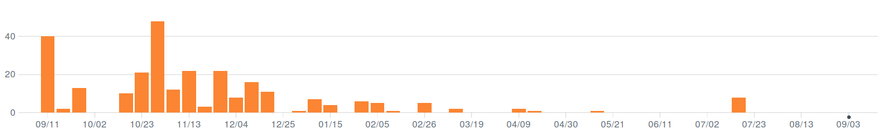

# Shifthelper (v1.1.4) overview Sept. 2017


Glossary:

 * Shifter: The single person responsible for 24 hours of FACT operation. 
 
     The shifthelper(SH) defines the "Shifter" as the person entered in the [shift schedule](https://www.fact-project.org/shift/). The SH considers the Shifter to be responsible from noon to noon.
 * Shift: The time between Startup and Shutdown. 
 
     The SH defines the "Shift" as the time between "Startup" and "Shutdown" task in the [observation  schedule](https://www.fact-project.org/schedule/)
    
# General Description

The shifthelper(SH) continously monitors the state of the FACT telescope via the publicly available status [smartfact website](http://fact-project.org/smartfact/index.html?sound#fact). In case human attention is needed (details below) the current *Shifter* is alerted per phone call and optionally [Telegram](https://telegram.org/) instant message.
In case the shifter does not acknowledge the issue on the SH-webinterface in time, automatically a (hardcoded) fallback person is alerted. In case a function inside the shifthelper throws an exception a hardcoded developer is alerted. 

## How does it work?

FACT serves a public status websites called [smartfact](http://fact-project.org/smartfact/index.html?sound#fact).
The dynamic content of the wesite is provided as text(`*.data`) and binary(`*.bin`) files in this public web-folder: http://fact-project.org/smartfact/data/. 
For example the textual content of this smratfact frontpage: 

 

is provided as this text file:

```
1504781095555	1504553178701		0	0
#ffffff	Idle [single-pe]
#ffffff	 &#9788; [09:32&darr;] &otimes;
#f0fff0	6.38
#f0fff0	15.6	19
#ffffff
#ffffff
```
A parser named [smart_fact_crawler](https://github.com/fact-project/smart_fact_crawler) has been written for these text-files and can be used or tried out independently from the shifthelper. In order to allow this parser to be further developed extrernally of the SH project, the SH requires the [specific version 0.3.0](https://github.com/fact-project/shifthelper/blob/master/setup.py#L32). 

**NOTE:** For a secure operation the format of the `.data` files must not be changed.

## When is human attention needed?

| Name                           | limit        | Interval[s] | conditions                     |
|--------------------------------|--------------|-------------|--------------------------------|
| SmartFactUpToDate              | > 10 min     | 120         | only during shift              |
| ParkingChecklistFilled         | after 10min  | 120         | only **outside** shift         |
| IsUserAwakeBeforeShutdown      | 20min before | 120         | only during shift              |
| MAGICWeatherUpToDate           | > 10 min     | 120         | only during shift              |
| Shifter in shift scheduler     |              | 120         | only during shift              |
| MainJsStatusCheck              | Running?     | 120         | only during shift              |
| WindSpeedCheck                 | > 50 km/h    | 120         | only during shift & not parked |
| WindGustCheck                  | > 50 km/h    | 120         | only during shift & not parked |
| MedianCurrentCheck             | > 115 uA     | 120         | only during shift              |
| MaximumCurrentCheck            | > 160 uA     | 120         | only during shift              |
| RelativeCameraTemperatureCheck | > 15.0°C     | 120         | only during shift              |
| BiasNotOperatingDuringDataRun  |              | 120         | only during shift              |
| BiasChannelsInOverCurrent      |              | 120         | only during shift              |
| BiasVoltageNotAtReference      |              | 120         | only during shift              |
| ContainerTooWarm               | > 42°C       | 120         | only during shift              |
| DriveInErrorDuringDataRun      |              | 120         | only during shift              |
| BiasVoltageOnButNotCalibrated  |              | 120         | only during shift              |
| DIMNetworkNotAvailable         |              | 120         | only during shift              |
| NoDimCtrlServerAvailable       |              | 120         | only during shift              |
| TriggerRateLowForTenMinutes    | < 1/sec      | 120         | only during shift              |
| Flare                          | (individual) | 300         |                                |

## What happens when a Check detects limit is exceeded?

In case one of the checks above turns out to be true, i.e. a limit is exceeded, it triggers a number of actions:

- A telephone call is generated
- An Alert message is displayed on the web interface.
- A telegram message is sent (optionally).

This is true for all of these checks, so in case multiple checks come up `True`, there are multiple messages on the web site, multiple telegram messages, but **often only one** telephone call, simply because while the phone is ringing, it cannot ring again and our phone dispatcher does not queue all calls we want to make indefinitly. So when the SH emits 10 Alerts (thus 10 calls) it might be you get a call, reject it .. and get called immediately again ... or not. However your first reaction is to look at the web interface ... and there you see how many and what alerts you have been called for. After two minutes the whole game repeats itself. So you get called again, and you get net messages on telegram and you get a Alert on the website.

Now assume you do not react to the call, because your phone battery is dead. Then the SH could call you all day, but you would not react. So after some time, we want to call somebody else. So when ever we sent out a call (for a certain reason say: "MainJsStatusCheck") we note the time of it. And when ever we need to send out a new call, we first look if we have not already sent out a call for this earlier, if we have ... and that time is longer ago than 15 minutes, we call the fallback shifter **in addition**. 

This would mean, that if "MainJsStatusCheck" fired at the beginning of the night, and again in the end of the night, we would immediately call the fallback shifter as well. So we have to reset. We reset all messages, that have been acknowledged. So if we have sent a call for "MainJsStatusCheck" and you pressed the `Acknowledge` button (for all massages of this type) on the web interface. Then the next time we are about to send a call for "MainJsStatusCheck", we first look have we already sent a call for this in the past? And now the answer turns up negative, because all of these messages have been acknowledged. So we do not call the fallback shifter but you, the shifter.

Now another feature of the `Acknowledge` button is this: If we are about to send an Alert for a certain check, we first look of for this check the has been an **`Acknowledge`ment within the last 10 minutes**. If so, the Alert goes still out, but it does not generate a call. It does only go to the log file and is sent via Telegram as a gentle reminder. It does not show up on the web-interface, so you do not have to re-`Acknowledge` it and it does also not generate another call.

This translates itself into this: If you were just called and have pressed the `Acknowledge` button, then effectively for the next 10 minutes this type of Check is not conducted (unless you use telegram). 

** Implications for the Dummy Alert**:

This is also true for the `Dummy Alert`. If you press the `Dummy Alert` button, the webinterface notes who pressed the button and when. The `Dummy Alert` Check sends an Alert if the `Dummy Alert` was sent by todays shifter within the last 3 minutes. The Check runs every minute (so you do not have to wait for the call too long). So when you press the button once, it will send an Alert, which results in a call, an Alert on the website (and a telegram message). **If you do not press the Acknowledge button** .. you will be called again after a minute .. and again after a minute. You will also see a new Alert message on the website. 

After some time, the calls stop, even when you never pressed acknowledge. Why? Well because the Check condition is not true anymore. The conditions is: 

 - you (he shifter) initiated a dummmy alert
 - and it happended within the last 3 minutes.

If you, however press the `Acknowledge` button. The same logic as explained above applies. We check if within the last 10 minutes .. all Alerts of the kind "DummyAlert" have been acknowledged. If so, no new call goes out and also no new Alert is displayed on the website. 
So if you want to test if the DummyTest works .. do not acknowledge it, until you believe it works. Be aware however ... if you press it every 3 minutes (or more often) ... for 15 minutes in total ... the fallback shifter will be called.


# Experience?

Shifthelper is running unmodified since 23.07.2017

## 23.07. Remove unnecessary fallback calls:

Under certain conditions acknowledged alerts were not being removed form the alert list
and thus the fallback was called unnecessaringly.

At the same moment, a more severe bug was found an removed. In case the call
to the shifter threw an exception, the fallback was not called.
An exception was raised, because the number to be called was an
international number from a country our Twilio contract was (for security reasons)
not allowed to make calls to. Now we may make calls to the whole world. This bug was found using the test call during startup. Making test calls (DummyAlert) is a part of the startup checklist.

## 17.07. Fix cache misses

This lead to expert calls about every 200 minutes.
Using a different cache library fixed these.


## 19.04. Fix connection timeouts of the mysql db

These lead to expert calls. Recycling the connection pool fixed these.

## 13.04. Multiple:

 * set smart_fact_crawler timeout = 5 seconds
        --> expert calls when smart_fact cannot be seen.
 * Fix cloning of local DB copy --> lead to expert calls

## 28.02. Allow shifters to change their phone numbers.

The shifter contact DB was cloned only once at SH startup. So changes in contact
details would require a SH restart.

## 06.02. Fix Flare Alerts

 * In case of FlareAlert a shifter was called without end.
 * Fallback shifter was not called in this case.


# How is it running?

SH is running on host off the island of La Palma. In the past it was running either on a host at ETH or at TU Dortmund. The process was relocated when one of the two locations had to be shut down for maintenance. In the future a high availablity host is planed to be used. 

The shifhelper runs two processes in supervised containers which get restarted when they crash ([Docker container](https://www.docker.com/)):

 * shifthelper
 * webinterface

In case the webinterface gets DDOSed, the shifthelper still runs and calls people,
but they cannot acknowledge the calls anymore. Very annoying but at least safe.

# Reported Safety issues?

In order to see if we can really trust the shifthelper v1.1.4, I listed below
the issues which were reported.

The plot below and the link list gives an overview about "Safety" issues.

As one can see from the Titles, even in these cases, still **sombody was called**, just not the right person.
So often fallback instead of shifter.
Or there was really no call, but it was realized during startup.

In fact **No critical issue was reported to us in 2017** but these issues here come closest to what might have been ciritcal.


 * 2016-10-22 - [no call - during test 21.10.16](https://github.com/fact-project/shifthelper/issues/118)

---

 * 2016-12-05 - [Calling fails comlpetely if shifter has not a valid phonenumber](https://github.com/fact-project/shifthelper/issues/168)
 * 2016-12-05 - [shifthelper does not call shifter - directly fallback shifter. tescall insufficient?](https://github.com/fact-project/shifthelper/issues/166)
 * 2016-12-10 - [no call, when smartfact dies](https://github.com/fact-project/shifthelper/issues/169)
 * 2016-12-16 - [shifters were not called](https://github.com/fact-project/shifthelper/issues/175)
 * 2016-12-29 - [shifter was not called - fallback was called instead](https://github.com/fact-project/shifthelper/issues/193)

 ---

 * 2017-02-04 - [Shifthelper kept calling and sending me Telegram messages every 5 minutes and informed me about FlareAlert](https://github.com/fact-project/shifthelper/issues/207)
 * 2017-02-04 - [Shifthelper does not call fallback shifter in case of FlareAlerts](https://github.com/fact-project/shifthelper/issues/209)

 ---

 * 2017-03-25 - [Test call does not work on first try](https://github.com/fact-project/shifthelper/issues/228)

---

 * 2017-05-24 - [FAD Loss results in call to Developer, not the shifter](https://github.com/fact-project/shifthelper/issues/238)


# How often is the Shifthelper touched?

The number of [code changes per week](https://github.com/fact-project/shifthelper/graphs/commit-activity) got less and less over the past year. 




# Future plans

We think the shifthelper v1.1.4 is very stable. So we want to avoid any changes to the code, apart form the necessary bug fixes, that might turn up.

However already now a future change is foreseen, that will need changes in the code base.

## Mutual Cross Check

In case the shifthelper process (or entire host) is unavailable, nobody is informed. This is a safety issue. 
We plan to solve it by introducing an independent process named maybe "shifthelper-heartbeat-check", running on an independent node, that continously checks if the shifthelper is running. At the same time, the shifthelper will get an additional check, that ensures this 
"shifthelper-heartbeat-check" is really up and running. Only such a mutual check ensures (with fairly high probability) that we get notified in case either one dies. 

For this, we need to give the heartbeact-check something to check. We propose to show a human readable timestamp on the shifthelper webinterface, that is updates by the shifthelper process, not by the webinterface. This timestamp is the shifthelper heartbeat. 
So this requires some changes in the webinterface and in the shifthelper.

## Starter-Shifter-Parker Mode

During short summer nights it can happen that between Startup and Shutdown there are only 5 or 6 hours. So even when shifters may sleep during the actual data taking phase, Startup and Shutdown duty still disrupt peoples sleep. So we think it is beneficial to divide the shift duty into 3 parts:

 * Starter: 
 
     The Starter helps the shifter by making sure the observation is started in the evening. She performs the checks mentioned on the [Startup Checklist](http://fact-project.org/Checklist/startup_checklist.html) and starts the observation scripts well in time. 
     
     The SH will call the Shifter, not the Starter, if the observation is not started after the Startup was scheduled in the observation schedule. In case the observation schedule is empty, in case of moon shutdown nights but also when no shifter is entered in the shift schedule, the SH will not call the Shifter.
     
 * Shifter:
 
     The Shifter is responsible for the observation within the time of her shift. She needs to make sure her availability via phone. Unless in case of problems she will not need to actually operate the telescope.
     
 * Parker:
 
     The Parker helps the shifter by making sure the telescope is parked in the morning. The parker notifies the SH that she is awake at 25minutes before the scheduled shutdown. Whe observes the correct shutdown and performs the [Shutdown Checklist](http://fact-project.org/Checklist/shutdown_checklist.html) within 20 minutes after the scheduled shutdown. In case of problems the SH wil call the shifter, not the Parker.
     
From a technical point of view, only the Shifter exists. The SH only knows about the Shifter neither the Starter nor the Parker exist for the SH. Thus for this mode to work, no changes in the SH code base are needed nor foreseen.
We are convinced that shift duty in within the Starter-Shifter-Parker (SSP) shift model is sufficiently easy, that shifters can be on shift for a prolonged time, such as e.g. one month. 
We further think that being Starter/Parker for a month, is a great opportunity for shifters to learn more about the telescope  or even become experts, as typically problems occur during these phases.

